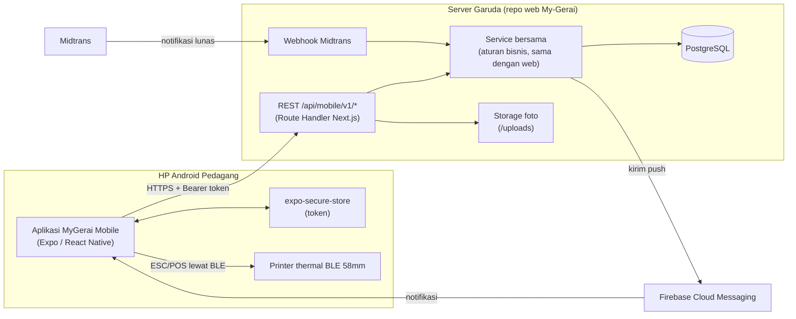

# Arsitektur Sistem — Aplikasi Android Pedagang

> Arsitektur **sisi aplikasi**. Arsitektur backend (database, pembayaran, webhook, Pencairan) ada di [ARSITEKTUR-SISTEM repo web](../../My-Gerai/docs/ARSITEKTUR-SISTEM.md). Keputusan induk aplikasi ini: ADR web **2026-10-07**.

## Gambaran Besar

Prinsip: **aplikasi adalah klien tipis.** Semua aturan bisnis, perhitungan uang, dan isolasi data antar Pedagang terjadi di server (repo web). Aplikasi menampilkan data, mengirim aksi, mencetak struk, dan menerima notifikasi.

## Alur Utama

### 1. Auth (token)

1. Login: aplikasi kirim No. HP + password ke `POST /auth/login` → server membalas satu **token** (tanpa refresh token). Lapak yang belum disetujui/ditolak/nonaktif mendapat `status` + `message` tanpa token.
2. Token disimpan di `expo-secure-store` dan di memori selama aplikasi hidup.
3. Setiap request membawa `Authorization: Bearer <token>`.
4. Token berumur **90 hari dan bergeser**: server memperpanjangnya sendiri selama aplikasi dipakai. Aplikasi tidak perlu logika refresh.
5. Respons `401` di request mana pun → hapus token, `queryClient.clear()`, arahkan ke layar login dengan pesan "Sesi berakhir, silakan login kembali."
6. Logout: panggil `POST /auth/logout` (server mencabut token dan token push perangkat), lalu hapus token lokal dan cache.
7. Pedagang yang di-suspend Admin otomatis mendapat `401` (sama seperti sesi web).

Detail lengkap: [API-MOBILE §2](../../My-Gerai/docs/API-MOBILE.md#2-autentikasi).

### 2. Push notification Pesanan lunas

1. Setelah login dan izin notifikasi diberikan (Android 13+ wajib minta izin), aplikasi mengambil **token Expo Push** (`ExponentPushToken[...]`) dan mendaftarkannya lewat `PUT /devices`.
2. Pesanan berubah ke `dibayar` (webhook Midtrans, atau Pedagang menandai lunas di mode QRIS Pribadi) → server mengirim push ke semua perangkat Pedagang itu.
3. Server mengirim lewat Expo Push Service. Isi push: judul + kode Pesanan + total + `data.orderId` (format: [API-MOBILE §5](../../My-Gerai/docs/API-MOBILE.md#5-push-notification)). **Tanpa** data sensitif ([RULES §7.6](RULES.md#7-keamanan)).
4. Notifikasi memakai **channel Android khusus Pesanan** (id wajib `pesanan`) dengan prioritas tinggi dan bunyi sendiri, supaya terdengar di lapak yang ramai.
5. Ketuk notifikasi → aplikasi membuka detail Pesanan dan mengambil data terbaru dari API.
6. Saat aplikasi terbuka, antrean Pesanan juga di-poll (TanStack Query `refetchInterval`) sebagai cadangan kalau push telat.

### 3. Cetak struk

1. Pedagang memilih printer sekali (scan BLE), ID printer disimpan di AsyncStorage.
2. Tombol cetak → aplikasi mengambil data struk dari API (endpoint yang sama dengan web) → encoder ESC/POS di HP menyusun byte → kirim lewat BLE dalam potongan kecil (ukuran MTU).
3. Isi dan format struk **harus identik** dengan versi web (`src/lib/utils/receipt.ts` di repo web). Perubahan format dilakukan di kedua tempat.
4. Printer mati/di luar jangkauan → pesan jelas dan tombol coba lagi, bukan gagal diam-diam.

### 4. Upload foto

Pilih foto → kompres dan perkecil di HP (expo-image-manipulator) → upload multipart ke endpoint API → server menyimpan ke Storage yang sama dengan web.

### 5. Jaringan lambat dan offline

- Data terakhir dari TanStack Query tetap ditampilkan saat jaringan putus, dengan penanda "Tidak ada koneksi".
- **Aksi tulis butuh online.** Tidak ada antrean aksi offline (mengubah status atau uang tanpa server terlalu berisiko). Tombol aksi menampilkan pesan jelas saat offline.
- Request punya timeout dan retry terbatas untuk GET. POST/PATCH tidak di-retry otomatis kecuali server menjamin idempoten.

## Lingkungan

| Lingkungan | API | Build |
|---|---|---|
| Dev | Server dev lokal repo web (IP LAN atau tunnel) atau staging | Development build di emulator/HP |
| Staging | Server staging | EAS profil `preview` (APK internal) |
| Produksi | Server produksi | EAS profil `production` (AAB ke Play Store) |

URL API dipilih lewat variabel lingkungan publik Expo (`EXPO_PUBLIC_API_URL`) per profil EAS. Nilai ini **bukan rahasia** ([RULES §7.1](RULES.md#7-keamanan)).

## Keputusan Arsitektur (ADR)

| Tanggal | Keputusan | Alasan |
|---|---|---|
| 2026-10-07 | Aplikasi Android Pedagang native dengan **React Native + Expo**, repo terpisah, backend lewat REST API `/api/mobile/v1/*` + auth token + push FCM. Ground truth domain tetap di repo web. | Keputusan User. Rincian dan alternatif yang ditolak: ADR web 2026-10-07 dan [TEKNOLOGI.md](TEKNOLOGI.md#kenapa-bukan-alternatif-lain). |
| 2026-10-07 | **Dokumen domain tidak disalin** ke repo ini; dirujuk lewat path relatif ke `../My-Gerai/docs/`, dua repo di-clone bersebelahan. | Keputusan User: satu sumber kebenaran, tidak ada dua salinan yang lama-lama berbeda. |
| 2026-10-07 | **Styling StyleSheet + `src/theme.ts`**, tanpa NativeWind. | Keputusan User: paling sederhana dan stabil terhadap upgrade Expo. |
| 2026-10-07 | **Auth token tunggal 90 hari bergeser** (tanpa refresh token) dan **push lewat Expo Push Service**, menggantikan rencana awal access + refresh token di dokumen ini. | Keputusan User di Plan mode Fase 12a (repo web): server sudah mengecek sesi di DB setiap request, jadi refresh token tidak menambah keamanan, hanya kerumitan. Lihat ADR web 2026-10-07. |
| 2026-10-07 | **Tanpa antrean aksi offline.** Aksi tulis selalu butuh server. | Aksi Pedagang menyangkut status Pesanan dan uang; konflik sinkronisasi lebih berbahaya daripada meminta Pedagang menunggu sinyal. |

> Tambahkan baris baru untuk setiap keputusan arsitektur aplikasi. Jangan hapus baris lama; tandai kalau digantikan. Sinkronkan dengan [CHANGELOG.md](../CHANGELOG.md).
